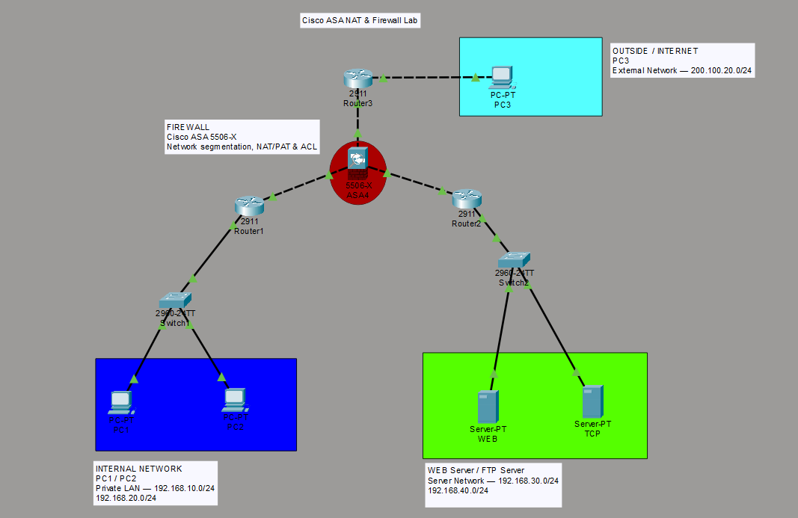

# 🛡️ Cisco ASA NAT & Firewall Lab

<p align="center">
  <b>Network Security • Firewall • NAT/PAT • ACL • DMZ</b>
</p>

<p align="center">
  A hands-on enterprise network security lab built with Cisco Packet Tracer.
</p>

---

## 📌 About This Project

This project simulates a small enterprise network using **Cisco ASA 5506-X** as the central firewall.

The network is segmented into three security zones:

- 🔵 **INSIDE** — Trusted internal users
- 🟢 **DMZ** — Public-facing servers
- 🔵 **OUTSIDE** — External / Internet users

The main objective is to implement controlled communication between these zones using **firewall policies, ACLs, NAT/PAT, security levels, and static routing**.

The lab also includes connectivity testing and troubleshooting to verify that the security policies work as intended.

---

## 🏗️ Network Topology



### Network Zones

| Zone | Purpose | Network |
|---|---|---|
| 🔵 **INSIDE** | Internal clients | `192.168.10.0/24`, `192.168.20.0/24` |
| 🟢 **DMZ** | WEB & FTP servers | `192.168.30.0/24`, `192.168.40.0/24` |
| 🔵 **OUTSIDE** | External client | `200.100.20.0/24` |

---

# 🌐 IP Addressing

### 🔵 INSIDE

| Device | IP Address | Role |
|---|---|---|
| ASA Inside | `192.168.1.1/30` | Firewall Interface |
| Router1 | `192.168.1.2/30` | Internal Router |
| PC1 | `192.168.10.2/24` | Internal Client |
| PC2 | `192.168.20.2/24` | Internal Client |

### 🟢 DMZ

| Device | IP Address | Role |
|---|---|---|
| ASA DMZ | `192.168.2.1/30` | Firewall Interface |
| Router2 | `192.168.2.2/30` | DMZ Router |
| WEB Server | `192.168.30.2/24` | HTTP Server |
| FTP Server | `192.168.40.2/24` | FTP Server |

### 🔵 OUTSIDE

| Device | IP Address | Role |
|---|---|---|
| ASA Outside | `200.100.10.1/29` | Firewall Interface |
| Router3 | `200.100.10.2/29` | External Router |
| PC3 | `200.100.20.2/24` | External Client |

---

# 🔥 Firewall Configuration

The Cisco ASA is configured as the security boundary between the **INSIDE, DMZ, and OUTSIDE** networks.

The firewall uses **security levels and ACLs** to control traffic between these zones.

### Security Levels

| Interface | Security Level | Purpose |
|---|---:|---|
| INSIDE | `50` | Trusted internal network |
| DMZ | `50` | Server network |
| OUTSIDE | `0` | Untrusted external network |

Security levels establish the trust relationship between ASA interfaces, while ACLs provide more specific control over which services are allowed.

---

# 📜 Access Control Policy

The firewall policy follows a **least-privilege approach**.

Only required services are permitted.

| Source | Destination | Protocol | Port | Action |
|---|---|---|---:|---|
| 🔵 INSIDE | 🟢 WEB Server | TCP | `80` | ✅ ALLOW |
| 🔵 INSIDE | 🟢 FTP Server | TCP | `21` | ✅ ALLOW |
| 🔵 OUTSIDE | 🟢 WEB Server | TCP | `80` | ✅ ALLOW |
| 🔵 OUTSIDE | 🟢 FTP Server | TCP | `21` | ❌ DENY |

### Policy Objective

The WEB service is exposed to external users, while FTP access is restricted to internal users.

This demonstrates **service-based traffic filtering** using the ASA firewall.

---

# 🔄 NAT & PAT

This lab implements both **PAT for internal users** and **Static NAT for DMZ servers**.

---

## 1. PAT — Internal Network

Internal clients use PAT when accessing the outside network.

```text
Internal Network
192.168.10.0/24
        │
        ▼
      Router1
        │
        ▼
    Cisco ASA
        │
        │ PAT
        ▼
  200.100.10.1
        │
        ▼
     OUTSIDE
